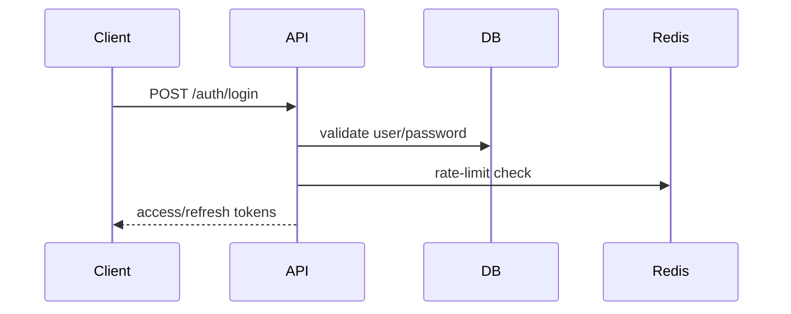
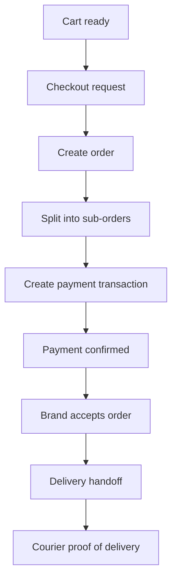
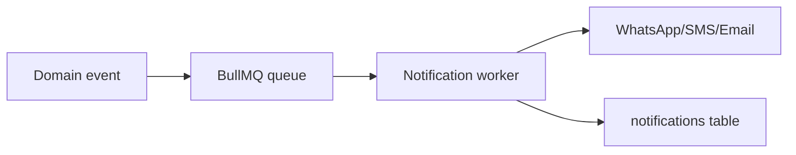

# FashionConnect Backend Architecture

## 1. Backend Architecture Overview

### 1.1 Recommended Solution Architecture

The backend should be implemented as a modular monolith using Express.js and TypeScript, backed by PostgreSQL through Prisma ORM. This choice is the most appropriate for the MVP and near-term roadmap because:

- the domain is highly relational and already modeled in PostgreSQL;
- the business workflows span authentication, catalog, orders, payments, delivery, disputes, and admin governance in tightly coupled ways;
- the team is small (three backend developers), so a modular monolith minimizes operational complexity while remaining extensible;
- future evolution into services can be handled later if the platform grows.

### 1.2 Technology Stack

- Runtime: Node.js 20+
- Framework: Express.js
- Language: TypeScript
- ORM: Prisma
- Database: PostgreSQL
- Cache/Queue: Redis + BullMQ
- Real-time: Socket.IO
- Auth: JWT access token + refresh token
- Containerization: Docker + Docker Compose
- API docs: Swagger/OpenAPI
- Validation: Zod (recommended) or express-validator
- Logging: Pino + structured logs
- Testing: Jest + Supertest + Prisma test database

### 1.3 Architectural Layers

- Presentation Layer: REST API routes
- Application Layer: controllers, services, use-cases
- Domain Layer: business rules and orchestration
- Data Layer: Prisma repositories, PostgreSQL, Redis, queues
- Integration Layer: payment gateways, notification providers, file storage, delivery partner webhooks

### 1.4 Core Design Principles

- Keep business logic inside services, not controllers
- Use transactions for financial and order-changing operations
- Treat money as append-only ledger data and not as mutable balance fields
- Enforce ownership and role-based authorization centrally
- Use idempotency keys for payment and webhook operations
- Make all external calls asynchronous where safe
- Log all admin actions and financial mutations

---

## 2. Module Breakdown

### 2.1 Authentication & Identity

#### Purpose

Provide account creation, login, OTP verification, token refresh, and session invalidation.

#### Business Description

This module governs user registration, authentication, identity verification, and session management. It must support end-users, brands, delivery companies, couriers, admins, and sub-admins.

#### Related Tables

- users
- refresh_tokens
- otp_codes
- user_permissions
- permissions

#### Dependencies

- Password hashing utility
- JWT service
- OTP provider (SMS gateway)
- Redis for rate limiting and token blacklist

#### Permissions

- Public endpoints: register, login, OTP send, OTP verify, refresh token
- Protected endpoints: logout, profile lookup, password change

#### Business Rules

- Passwords must never be stored in plaintext.
- OTPs must expire and be single-use.
- Refresh tokens are revocable and device-scoped.
- Authentication should support role-aware claims in the JWT.

---

### 2.2 Users & Profiles

#### Purpose

Manage authenticated user identity and profile-related actions.

#### Business Description

Users can manage basic profile information, addresses, and account preferences.

#### Related Tables

- users
- addresses

#### Dependencies

- Auth module
- Upload module

#### Permissions

- Self-service for end-users and brand owners
- Admin can read user profiles

#### Business Rules

- Users may have multiple addresses, but only one default address.
- Profile updates must not change role or account ownership data.

---

### 2.3 Brands & Verification

#### Purpose

Support brand registration, document submission, verification workflow, and public brand profile access.

#### Business Description

Brands onboard to the marketplace, submit KYC documents, and move through the verification tiers. Approved brands gain access to catalog and order-management features.

#### Related Tables

- brands
- brand_documents
- brand_social_links
- brand_followers

#### Dependencies

- Upload module
- Notification module
- Admin moderation workflow

#### Permissions

- Brand owners: manage own brand and docs
- Admin: verify/reject/suspend brand
- Public: read approved brand profiles

#### Business Rules

- Verification tier transitions are governed by admin approval.
- Trusted brands receive enhanced privileges and ranking benefits.
- Brand documents are reviewable and auditable.

---

### 2.4 Catalog & Products

#### Purpose

Enable products, categories, variants, images, and soft-deletion behavior.

#### Business Description

Brands manage categories and products, including variants, stock, and pricing. Public catalog endpoints should be available without authentication.

#### Related Tables

- categories
- products
- product_media
- variants
- wishlists
- discounts
- product_discounts

#### Dependencies

- Brands module
- Upload module
- Notification module

#### Permissions

- Brand owners: CRUD on own catalog
- Admin: view and moderate catalog content
- Public: browse and view products

#### Business Rules

- Product deletion is soft-delete via is_active.
- Category deletion must be soft-delete or reassign references.
- Variant uniqueness is enforced by (product_id, color, size).

---

### 2.5 Cart & Checkout

#### Purpose

Allow end-users to build a cart and convert it into an order.

#### Business Description

The cart is stored per user. At checkout, a multi-brand cart is split into sub-orders, one per brand, and a checkout-level order is created.

#### Related Tables

- carts
- cart_items
- orders
- sub_orders
- order_items
- discounts
- discount_usages

#### Dependencies

- Auth module
- Products/variants
- Payments module
- Delivery pricing logic

#### Permissions

- End-user only for own cart and checkout
- Admin can view but not modify checkout data except for support cases

#### Business Rules

- Cart items must reference available and active variants.
- Checkout must be atomic.
- Payment method can be COD or digital methods.

---

### 2.6 Orders & Fulfillment

#### Purpose

Support order lifecycle management, sub-order handling, acceptance, rejection, handoff, and delivery status.

#### Business Description

Orders are created at checkout and split into sub-orders per brand. Brands manage acceptance and handoff. Delivery partners and couriers execute delivery.

#### Related Tables

- orders
- sub_orders
- sub_order_status_history
- order_items
- returns
- delivery_proofs
- cod_reconciliations

#### Dependencies

- Cart/checkout module
- Delivery module
- Payments module
- Notifications module

#### Permissions

- End-user: view own orders
- Brand: manage own sub-orders
- Delivery company/courier: access assigned sub-orders
- Admin: observe and intervene

#### Business Rules

- Status changes must be appended to history.
- Delivery proof is required for delivered state.
- Rejection, cancellation, and return flows must be auditable.

---

### 2.7 Delivery & Courier Operations

#### Purpose

Allow delivery companies and couriers to receive, assign, track, and reconcile deliveries.

#### Business Description

The delivery module handles fee tiers, coverage zones, courier assignment, proof of delivery, and COD reconciliation.

#### Related Tables

- delivery_companies
- delivery_zones
- couriers
- delivery_proofs
- cod_reconciliations

#### Dependencies

- Orders & sub-orders
- Notifications
- Payments/ledger

#### Permissions

- Delivery company: manage own fleet and zones
- Courier: manage assigned orders
- Admin: oversee delivery partners

#### Business Rules

- COD reconciliation must be auditable and linked to sub-orders.
- Delivery proofs must be stored with evidence.

---

### 2.8 Payments, Payouts & Wallets

#### Purpose

Handle payment intent creation, gateway callbacks, payout approval, and wallet-ledger operations.

#### Business Description

The payment layer supports Stripe, Paymob, wallets, COD, Fawry, and installment methods. All money movement must be recorded in append-only ledger tables.

#### Related Tables

- transactions
- payouts
- wallets
- wallet_transactions
- loyalty_points
- referrals

#### Dependencies

- Orders module
- Notifications module
- Admin workflow

#### Permissions

- End-user: view own payment and wallet history
- Brand: view payout history
- Admin: approve payouts and review transactions

#### Business Rules

- Payment state changes must be idempotent.
- Wallets and brand balances are derived from ledger rows, not authoritative sources.
- Payout approval must be logged.

---

### 2.9 Reviews & Reputation

#### Purpose

Collect product and brand reviews and use them in trust and ranking systems.

#### Business Description

Users submit product or brand reviews. Reviews feed ranking and vendor scorecards.

#### Related Tables

- reviews
- review_images

#### Dependencies

- Orders module
- Products/brands

#### Permissions

- End-user: create reviews for completed purchases
- Admin: moderate reviews

#### Business Rules

- Reviews should be tied to verified purchases where possible.
- Reviews cannot be submitted for invalid or non-completed orders.

---

### 2.10 Chat & Messaging

#### Purpose

Enable real-time messaging between users and brands.

#### Business Description

A chat thread is created per end-user and brand, supporting messages, flagging, and moderation.

#### Related Tables

- chat_threads
- chat_messages

#### Dependencies

- Auth module
- Notifications module
- Socket.IO

#### Permissions

- End-users and brands: access own threads
- Admin: review flagged content

#### Business Rules

- Messages may be flagged for moderation.
- Thread ownership is tied to the user and brand involved.

---

### 2.11 Notifications

#### Purpose

Deliver transactional and operational notifications to users.

#### Business Description

Notifications are created for order, payment, delivery, chat, pricing, and account events. The system should support WhatsApp, SMS, email, and push channels.

#### Related Tables

- notification_templates
- notifications

#### Dependencies

- Events and jobs system
- Messaging providers

#### Permissions

- Authenticated user: read and mark own notifications
- Admin: trigger or review system notifications

#### Business Rules

- Notification templates are channel-specific and localized.
- Notification delivery is asynchronous.

---

### 2.12 Advertising & Ranking

#### Purpose

Support ad packages, campaigns, and precomputed ranking scores.

#### Business Description

Brands can purchase ad packages and generate ranking impact. Ranking scores are precomputed by background jobs rather than calculated live.

#### Related Tables

- ad_packages
- ad_campaigns
- ranking_scores

#### Dependencies

- Brands module
- Admin module
- Background job service

#### Permissions

- Brand: launch campaigns for own brand
- Admin: manage packages and override ranking

#### Business Rules

- Ranking should be precomputed nightly.
- Manual ranking overrides must be audit logged.

---

### 2.13 Trust, Safety & Admin Governance

#### Purpose

Support dispute handling, moderation, and admin audit logging.

#### Business Description

The admin and trust module handles disputes, moderation flags, user safety, and audit logging for platform-sensitive actions.

#### Related Tables

- disputes
- dispute_evidence
- moderation_flags
- admin_audit_log

#### Dependencies

- Orders, chat, products, admin auth

#### Permissions

- Admin and scoped sub-admins

#### Business Rules

- All admin actions must be logged.
- Disputes can be linked to order, chat, or product events.

---

## 3. Controllers

### 3.1 Authentication Controller

- Name: AuthController
- Purpose: register, login, OTP, token refresh, logout
- Methods: register, login, sendOtp, verifyOtp, refreshToken, logout
- Responsibilities: create sessions, verify credentials, issue JWTs, manage OTP lifecycle
- Authorization: public for auth operations, protected for logout
- Validation Required: yes
- Tables Used: users, refresh_tokens, otp_codes
- Possible Errors: invalid_credentials, otp_expired, user_exists, rate_limited, token_invalid

### 3.2 User Controller

- Name: UserController
- Purpose: manage authenticated user profile and addresses
- Methods: getMe, updateMe, listAddresses, createAddress, updateAddress, deleteAddress
- Responsibilities: profile updates, address management
- Authorization: self only
- Validation Required: yes
- Tables Used: users, addresses
- Possible Errors: not_found, forbidden, duplicate_default_address

### 3.3 Brand Controller

- Name: BrandController
- Purpose: manage brand onboarding and profile
- Methods: registerBrand, getBrandById, updateBrand, getVerificationStatus, listBrands, followBrand
- Responsibilities: brand lifecycle, public profile, verification state
- Authorization: public for registration/public profile; owner/admin for private operations
- Validation Required: yes
- Tables Used: brands, brand_documents, brand_social_links, brand_followers
- Possible Errors: not_found, brand_not_verified, invalid_state_transition

### 3.4 Category Controller

- Name: CategoryController
- Purpose: manage categories
- Methods: listCategories, createCategory, updateCategory, deleteCategory
- Responsibilities: category CRUD and visibility handling
- Authorization: brand owner/admin
- Validation Required: yes
- Tables Used: categories
- Possible Errors: invalid_parent, category_in_use

### 3.5 Product Controller

- Name: ProductController
- Purpose: manage products and media
- Methods: listProducts, getProduct, createProduct, updateProduct, deleteProduct, uploadMedia
- Responsibilities: catalog CRUD and media enrichment
- Authorization: brand owner/admin
- Validation Required: yes
- Tables Used: products, product_media, variants
- Possible Errors: invalid_variant, stock_invalid, not_found

### 3.6 Cart Controller

- Name: CartController
- Purpose: manage user cart
- Methods: getCart, addItem, updateItem, removeItem
- Responsibilities: cart state maintenance and price capture
- Authorization: self only
- Validation Required: yes
- Tables Used: carts, cart_items, variants
- Possible Errors: out_of_stock, variant_not_found

### 3.7 Checkout Controller

- Name: CheckoutController
- Purpose: convert cart into order
- Methods: checkout
- Responsibilities: create order, split sub-orders, reserve stock, create payment intent/transaction
- Authorization: self only
- Validation Required: yes
- Tables Used: orders, sub_orders, order_items, transactions, discount_usages
- Possible Errors: payment_failed, inventory_insufficient, address_invalid

### 3.8 Order Controller

- Name: OrderController
- Purpose: manage order lifecycle
- Methods: listOrders, getOrder, acceptSubOrder, rejectSubOrder, handoffSubOrder, trackOrder
- Responsibilities: status transition and fulfillment flow
- Authorization: owner, brand, admin, delivery company/courier where applicable
- Validation Required: yes
- Tables Used: orders, sub_orders, sub_order_status_history
- Possible Errors: invalid_transition, not_found, unauthorized

### 3.9 Delivery Controller

- Name: DeliveryController
- Purpose: manage delivery company and courier operations
- Methods: listCompanyOrders, assignCourier, configureZone, listCouriers, createCourier, updateCoverage, getDashboard, getReconciliation
- Responsibilities: fleet and zone management
- Authorization: delivery company owner/admin
- Validation Required: yes
- Tables Used: delivery_companies, delivery_zones, couriers, cod_reconciliations
- Possible Errors: courier_not_found, invalid_zone, unauthorized

### 3.10 Courier Controller

- Name: CourierController
- Purpose: manage courier task execution
- Methods: getAssignedOrders, getOrderDetail, updateStatus, submitProof, getEarnings, getRoute
- Responsibilities: delivery status updates and proof submission
- Authorization: assigned courier only
- Validation Required: yes
- Tables Used: sub_orders, delivery_proofs, cod_reconciliations
- Possible Errors: invalid_status, proof_required

### 3.11 Payment Controller

- Name: PaymentController
- Purpose: handle gateway operations and webhooks
- Methods: createIntent, handleStripeWebhook, handlePaymobWebhook, getPaymentHistory
- Responsibilities: payment intent creation and payment state reconciliation
- Authorization: public for webhooks, self for history
- Validation Required: yes
- Tables Used: transactions, orders, wallets, wallet_transactions
- Possible Errors: payment_failed, webhook_invalid, duplicate_event

### 3.12 Payout Controller

- Name: PayoutController
- Purpose: approve and review payouts
- Methods: listPayouts, approvePayout, rejectPayout
- Responsibilities: payout lifecycle management and ledger updates
- Authorization: admin/scoped sub-admin
- Validation Required: yes
- Tables Used: payouts, admin_audit_log
- Possible Errors: payout_not_found, already_processed

### 3.13 Wallet Controller

- Name: WalletController
- Purpose: manage wallet and refunds
- Methods: getWallet, getWalletTransactions, refundToWallet
- Responsibilities: wallet balance and transaction retrieval
- Authorization: self only
- Validation Required: yes
- Tables Used: wallets, wallet_transactions
- Possible Errors: insufficient_balance, invalid_reason

### 3.14 Review Controller

- Name: ReviewController
- Purpose: create and moderate reviews
- Methods: createProductReview, createBrandReview, listReviews, deleteReview
- Responsibilities: review lifecycle
- Authorization: self for create; admin for moderation
- Validation Required: yes
- Tables Used: reviews, review_images
- Possible Errors: invalid_order_item, review_duplicate

### 3.15 Chat Controller

- Name: ChatController
- Purpose: manage chat threads and messages
- Methods: createThread, listMessages, sendMessage, reportMessage
- Responsibilities: messaging and moderation hooks
- Authorization: thread participants/admin
- Validation Required: yes
- Tables Used: chat_threads, chat_messages
- Possible Errors: thread_not_found, unauthorized

### 3.16 Notification Controller

- Name: NotificationController
- Purpose: manage notifications
- Methods: listNotifications, markAsRead
- Responsibilities: notification retrieval and state updates
- Authorization: self only
- Validation Required: no
- Tables Used: notifications
- Possible Errors: not_found

### 3.17 Admin Controller

- Name: AdminController
- Purpose: support admin operational workflows
- Methods: getDashboard, listBrandsForReview, verifyBrand, rejectBrand, suspendBrand, listDisputes, resolveDispute, listFlags, actOnFlag, listTransactions, getPayouts, overrideRanking
- Responsibilities: governance and oversight
- Authorization: admin/sub-admin with scope
- Validation Required: yes
- Tables Used: brands, disputes, moderation_flags, admin_audit_log, ranking_scores, payouts
- Possible Errors: forbidden, invalid_scope

### 3.18 Upload Controller

- Name: UploadController
- Purpose: upload files to object storage and return signed URLs
- Methods: uploadFile
- Responsibilities: file ingestion for docs, proof of delivery, product images, reviews
- Authorization: authenticated user or admin
- Validation Required: yes
- Tables Used: external object storage; no direct DB row unless metadata is persisted
- Possible Errors: invalid_file_type, storage_error

---

## 4. Routes and Endpoint Design

### 4.1 Authentication Routes

| Method | Endpoint         | Auth | Roles                  | Controller                  | DB Operations                                                   | Status Codes  |
| ------ | ---------------- | ---- | ---------------------- | --------------------------- | --------------------------------------------------------------- | ------------- |
| POST   | /auth/register   | No   | Public                 | AuthController.register     | Insert into users; optionally create wallet/brand profile later | 201, 400, 409 |
| POST   | /auth/login      | No   | Public                 | AuthController.login        | Read user by phone/email; verify password; issue tokens         | 200, 401      |
| POST   | /auth/otp/send   | No   | Public                 | AuthController.sendOtp      | Insert or update otp_codes                                      | 200, 400      |
| POST   | /auth/otp/verify | No   | Public                 | AuthController.verifyOtp    | Validate OTP; update user is_verified                           | 200, 400      |
| POST   | /auth/refresh    | No   | Public                 | AuthController.refreshToken | Validate refresh token and issue new access token               | 200, 401      |
| POST   | /auth/logout     | Yes  | Any authenticated user | AuthController.logout       | Revoke refresh token                                            | 200, 401      |

#### Example Response Shapes

Success response for login:

```json
{
  "success": true,
  "message": "Login successful",
  "data": {
    "accessToken": "eyJhbGciOi...",
    "refreshToken": "eyJhbGciOi...",
    "user": {
      "id": "uuid",
      "phone": "+201001234567",
      "email": "user@example.com",
      "role": "end_user",
      "isVerified": true
    }
  }
}
```

Validation error:

```json
{
  "success": false,
  "message": "Validation failed",
  "errors": [
    {
      "field": "email",
      "message": "Email is required"
    }
  ]
}
```

Unauthorized:

```json
{
  "success": false,
  "message": "Unauthorized",
  "error": "INVALID_TOKEN"
}
```

---

### 4.2 User and Address Routes

| Method | Endpoint                       | Auth | Roles             | Controller                   | DB Operations     | Status Codes |
| ------ | ------------------------------ | ---- | ----------------- | ---------------------------- | ----------------- | ------------ |
| GET    | /users/me                      | Yes  | Any authenticated | UserController.getMe         | Read user profile | 200, 404     |
| PATCH  | /users/me                      | Yes  | Any authenticated | UserController.updateMe      | Update users row  | 200, 400     |
| GET    | /users/me/addresses            | Yes  | Any authenticated | UserController.listAddresses | Read addresses    | 200          |
| POST   | /users/me/addresses            | Yes  | Any authenticated | UserController.createAddress | Insert address    | 201, 400     |
| PATCH  | /users/me/addresses/:addressId | Yes  | Self              | UserController.updateAddress | Update address    | 200, 404     |
| DELETE | /users/me/addresses/:addressId | Yes  | Self              | UserController.deleteAddress | Delete address    | 200, 404     |

#### Response Example

```json
{
  "success": true,
  "message": "Address created successfully",
  "data": {
    "addressId": "uuid",
    "label": "home",
    "governorate": "Cairo",
    "city": "Nasr City",
    "street": "Street 10",
    "buildingNo": "12",
    "contactPhone": "+201000000000",
    "isDefault": true
  }
}
```

---

### 4.3 Brand Routes

| Method | Endpoint                             | Auth | Roles                      | Controller                            | DB Operations                 | Status Codes |
| ------ | ------------------------------------ | ---- | -------------------------- | ------------------------------------- | ----------------------------- | ------------ |
| POST   | /brands/register                     | No   | Public                     | BrandController.registerBrand         | Insert brands row             | 201, 400     |
| GET    | /brands                              | No   | Public                     | BrandController.listBrands            | Read active approved brands   | 200          |
| GET    | /brands/:brandId                     | No   | Public for approved brands | BrandController.getBrandById          | Read brand profile            | 200, 404     |
| PATCH  | /brands/:brandId                     | Yes  | Brand owner/admin          | BrandController.updateBrand           | Update brands row             | 200, 403     |
| GET    | /brands/:brandId/verification-status | Yes  | Brand owner/admin/public   | BrandController.getVerificationStatus | Read brand + docs             | 200          |
| POST   | /brands/:brandId/documents           | Yes  | Brand owner                | BrandController.uploadDocument        | Insert brand_documents        | 201          |
| GET    | /brands/:brandId/documents           | Yes  | Brand owner/admin          | BrandController.listDocuments         | Read brand_documents          | 200          |
| PATCH  | /brands/:brandId/follow              | Yes  | End-user                   | BrandController.followBrand           | Insert/delete brand_followers | 200          |

#### Response Example

```json
{
  "success": true,
  "message": "Brand profile retrieved successfully",
  "data": {
    "id": "uuid",
    "displayName": "Fashion House",
    "verificationStatus": "basic_verified",
    "rating": 4.7,
    "logoUrl": "https://cdn.example.com/logo.png",
    "isActive": true
  }
}
```

---

### 4.4 Category and Product Routes

| Method | Endpoint                              | Auth | Roles             | Controller                        | DB Operations             | Status Codes |
| ------ | ------------------------------------- | ---- | ----------------- | --------------------------------- | ------------------------- | ------------ |
| GET    | /categories                           | No   | Public            | CategoryController.listCategories | Read categories           | 200          |
| POST   | /categories                           | Yes  | Brand owner/admin | CategoryController.createCategory | Insert category           | 201          |
| PATCH  | /categories/:categoryId               | Yes  | Brand owner/admin | CategoryController.updateCategory | Update category           | 200          |
| DELETE | /categories/:categoryId               | Yes  | Brand owner/admin | CategoryController.deleteCategory | Soft-delete or reassign   | 200          |
| GET    | /products/search                      | No   | Public            | ProductController.searchProducts  | Search products + filters | 200          |
| GET    | /products/:productId                  | No   | Public            | ProductController.getProduct      | Read product + variants   | 200          |
| POST   | /brands/:brandId/products             | Yes  | Brand owner       | ProductController.createProduct   | Insert product            | 201          |
| PATCH  | /brands/:brandId/products/:productId  | Yes  | Brand owner       | ProductController.updateProduct   | Update product            | 200          |
| DELETE | /brands/:brandId/products/:productId  | Yes  | Brand owner       | ProductController.deleteProduct   | Mark is_active false      | 200          |
| POST   | /brands/:brandId/products/bulk-import | Yes  | Brand owner       | ProductController.bulkImport      | Create async job          | 202          |
| POST   | /products/:productId/media            | Yes  | Brand owner       | ProductController.uploadMedia     | Insert product_media      | 201          |

#### Response Example

```json
{
  "success": true,
  "message": "Product created successfully",
  "data": {
    "id": "uuid",
    "brandId": "uuid",
    "nameAr": "فستان",
    "nameEn": "Dress",
    "isActive": true,
    "variants": [
      {
        "id": "uuid",
        "sku": "DRESS-RED-M",
        "color": "red",
        "size": "M",
        "price": 399.99,
        "stock": 12
      }
    ]
  }
}
```

---

### 4.5 Cart and Checkout Routes

| Method | Endpoint                     | Auth | Roles    | Controller                  | DB Operations                        | Status Codes |
| ------ | ---------------------------- | ---- | -------- | --------------------------- | ------------------------------------ | ------------ |
| GET    | /users/me/cart               | Yes  | End-user | CartController.getCart      | Read cart and items                  | 200          |
| POST   | /users/me/cart/items         | Yes  | End-user | CartController.addItem      | Insert/update cart_items             | 201          |
| PATCH  | /users/me/cart/items/:itemId | Yes  | End-user | CartController.updateItem   | Update quantity                      | 200          |
| DELETE | /users/me/cart/items/:itemId | Yes  | End-user | CartController.removeItem   | Delete item                          | 200          |
| POST   | /users/me/checkout           | Yes  | End-user | CheckoutController.checkout | Create order/sub-orders/transactions | 201, 402     |

#### Response Example

```json
{
  "success": true,
  "message": "Checkout completed successfully",
  "data": {
    "orderId": "uuid",
    "orderNumber": 1001,
    "paymentStatus": "paid",
    "totalAmount": 899.98,
    "subOrders": [
      {
        "id": "uuid",
        "brandId": "uuid",
        "status": "pending",
        "total": 399.99
      }
    ]
  }
}
```

---

### 4.6 Orders and Fulfillment Routes

| Method | Endpoint                                 | Auth | Roles                | Controller                      | DB Operations                  | Status Codes |
| ------ | ---------------------------------------- | ---- | -------------------- | ------------------------------- | ------------------------------ | ------------ |
| GET    | /users/me/orders                         | Yes  | End-user             | OrderController.listOrders      | Read orders for user           | 200          |
| GET    | /users/me/orders/:orderId                | Yes  | End-user/brand/admin | OrderController.getOrder        | Read order + sub-orders        | 200          |
| PATCH  | /brands/:brandId/orders/:orderId/accept  | Yes  | Brand owner          | OrderController.acceptSubOrder  | Update sub_order + history     | 200          |
| PATCH  | /brands/:brandId/orders/:orderId/reject  | Yes  | Brand owner          | OrderController.rejectSubOrder  | Update sub_order + history     | 200          |
| PATCH  | /brands/:brandId/orders/:orderId/handoff | Yes  | Brand owner          | OrderController.handoffSubOrder | Update delivery_company_id     | 200          |
| GET    | /orders/:orderId/tracking                | Yes  | Relevant roles       | OrderController.trackOrder      | Read status history and proofs | 200          |
| POST   | /orders/:orderId/returns                 | Yes  | End-user             | OrderController.createReturn    | Insert returns row             | 201          |

#### Response Example

```json
{
  "success": true,
  "message": "Sub-order accepted successfully",
  "data": {
    "subOrderId": "uuid",
    "status": "accepted",
    "acceptedAt": "2026-07-26T00:00:00.000Z"
  }
}
```

---

### 4.7 Delivery and Courier Routes

| Method | Endpoint                                             | Auth | Roles                  | Controller                               | DB Operations                      | Status Codes |
| ------ | ---------------------------------------------------- | ---- | ---------------------- | ---------------------------------------- | ---------------------------------- | ------------ |
| POST   | /delivery-companies/:id/orders/webhook               | No   | Delivery company       | DeliveryController.receiveWebhook        | Insert/update sub-order assignment | 200          |
| GET    | /delivery-companies/:id/orders                       | Yes  | Delivery company/admin | DeliveryController.listCompanyOrders     | Read sub_orders by company         | 200          |
| PATCH  | /delivery-companies/:id/orders/:orderId/assign       | Yes  | Delivery company       | DeliveryController.assignCourier         | Update courier_id                  | 200          |
| PATCH  | /delivery-companies/:id/auto-assign-rules            | Yes  | Delivery company       | DeliveryController.updateAutoAssignRules | Update config in DB or cache       | 200          |
| GET    | /delivery-companies/:id/couriers                     | Yes  | Delivery company/admin | DeliveryController.listCouriers          | Read couriers                      | 200          |
| POST   | /delivery-companies/:id/couriers                     | Yes  | Delivery company       | DeliveryController.createCourier         | Insert courier                     | 201          |
| DELETE | /delivery-companies/:id/couriers/:courierId          | Yes  | Delivery company       | DeliveryController.deleteCourier         | Disable courier                    | 200          |
| PATCH  | /delivery-companies/:id/couriers/:courierId/coverage | Yes  | Delivery company       | DeliveryController.updateCoverage        | Update coverage_zone_id            | 200          |
| GET    | /delivery-companies/:id/fee-tiers                    | Yes  | Delivery company/admin | DeliveryController.getFeeTiers           | Read delivery_zones                | 200          |
| POST   | /delivery-companies/:id/fee-tiers                    | Yes  | Delivery company       | DeliveryController.createFeeTier         | Insert delivery_zones              | 201          |
| GET    | /couriers/:id/orders                                 | Yes  | Assigned courier       | CourierController.getAssignedOrders      | Read sub_orders by courier         | 200          |
| GET    | /couriers/:id/orders/:orderId                        | Yes  | Assigned courier       | CourierController.getOrderDetail         | Read sub_order + address           | 200          |
| PATCH  | /couriers/:id/orders/:orderId/status                 | Yes  | Assigned courier       | CourierController.updateStatus           | Update sub_order + history         | 200          |
| POST   | /couriers/:id/orders/:orderId/proof                  | Yes  | Assigned courier       | CourierController.submitProof            | Insert delivery_proofs             | 201          |
| GET    | /couriers/:id/earnings                               | Yes  | Assigned courier       | CourierController.getEarnings            | Aggregate COD and delivery fees    | 200          |
| GET    | /couriers/:id/route                                  | Yes  | Assigned courier       | CourierController.getRoute               | Read route data                    | 200          |

#### Response Example

```json
{
  "success": true,
  "message": "Proof submitted successfully",
  "data": {
    "deliveryProofId": "uuid",
    "subOrderId": "uuid",
    "photoUrl": "https://cdn.example.com/proof.jpg",
    "otpVerified": false,
    "submittedAt": "2026-07-26T00:00:00.000Z"
  }
}
```

---

### 4.8 Payments, Wallets, and Payouts Routes

| Method | Endpoint                         | Auth | Roles             | Controller                             | DB Operations                                 | Status Codes |
| ------ | -------------------------------- | ---- | ----------------- | -------------------------------------- | --------------------------------------------- | ------------ |
| POST   | /payments/intents                | Yes  | End-user          | PaymentController.createIntent         | Insert transactions; create payment intent    | 201          |
| POST   | /payments/webhooks/stripe        | No   | Public gateway    | PaymentController.handleStripeWebhook  | Update transaction status and order state     | 200          |
| POST   | /payments/webhooks/paymob        | No   | Public gateway    | PaymentController.handlePaymobWebhook  | Update transaction status and order state     | 200          |
| GET    | /users/me/wallet                 | Yes  | Self              | WalletController.getWallet             | Read wallet                                   | 200          |
| GET    | /users/me/wallet/transactions    | Yes  | Self              | WalletController.getWalletTransactions | Read wallet_transactions                      | 200          |
| GET    | /brands/:brandId/payouts         | Yes  | Brand owner/admin | PayoutController.listPayouts           | Read payouts                                  | 200          |
| POST   | /admin/payouts/:payoutId/approve | Yes  | Admin/scoped      | PayoutController.approvePayout         | Update payout status and create ledger effect | 200          |

#### Response Example

```json
{
  "success": true,
  "message": "Payment intent created",
  "data": {
    "paymentIntentId": "pi_123",
    "clientSecret": "secret",
    "transactionId": "uuid"
  }
}
```

---

### 4.9 Reviews and Chat Routes

| Method | Endpoint                     | Auth | Roles              | Controller                           | DB Operations             | Status Codes |
| ------ | ---------------------------- | ---- | ------------------ | ------------------------------------ | ------------------------- | ------------ |
| POST   | /products/:productId/reviews | Yes  | End-user           | ReviewController.createProductReview | Insert reviews and images | 201          |
| POST   | /brands/:brandId/reviews     | Yes  | End-user           | ReviewController.createBrandReview   | Insert reviews            | 201          |
| GET    | /products/:productId/reviews | No   | Public             | ReviewController.listReviews         | Read reviews              | 200          |
| POST   | /chats                       | Yes  | End-user           | ChatController.createThread          | Insert chat_threads       | 201          |
| GET    | /chats/:threadId/messages    | Yes  | Participants/admin | ChatController.listMessages          | Read chat_messages        | 200          |
| POST   | /chats/:threadId/messages    | Yes  | Participants       | ChatController.sendMessage           | Insert chat_messages      | 201          |
| POST   | /chats/:threadId/report      | Yes  | Participants/admin | ChatController.reportMessage         | Insert moderation_flags   | 201          |

#### Response Example

```json
{
  "success": true,
  "message": "Message sent",
  "data": {
    "messageId": "uuid",
    "threadId": "uuid",
    "senderId": "uuid",
    "body": "Hello, is this still available?",
    "sentAt": "2026-07-26T00:00:00.000Z"
  }
}
```

---

### 4.10 Notification Routes

| Method | Endpoint                            | Auth | Roles             | Controller                               | DB Operations            | Status Codes |
| ------ | ----------------------------------- | ---- | ----------------- | ---------------------------------------- | ------------------------ | ------------ |
| GET    | /notifications                      | Yes  | Any authenticated | NotificationController.listNotifications | Read notifications       | 200          |
| PATCH  | /notifications/:notificationId/read | Yes  | Self              | NotificationController.markAsRead        | Update notifications row | 200          |

#### Response Example

```json
{
  "success": true,
  "message": "Notifications retrieved",
  "data": {
    "items": [
      {
        "id": "uuid",
        "templateCode": "order.shipped",
        "isRead": false,
        "payload": {
          "orderId": "uuid"
        }
      }
    ],
    "unreadCount": 3
  }
}
```

---

### 4.11 Admin Routes

| Method | Endpoint                           | Auth | Roles           | Controller                          | DB Operations                     | Status Codes |
| ------ | ---------------------------------- | ---- | --------------- | ----------------------------------- | --------------------------------- | ------------ |
| GET    | /admin/dashboard                   | Yes  | Admin           | AdminController.getDashboard        | Aggregate metrics                 | 200          |
| GET    | /admin/brands                      | Yes  | Admin           | AdminController.listBrandsForReview | Read brands with filter           | 200          |
| PATCH  | /admin/brands/:brandId/verify      | Yes  | Admin           | AdminController.verifyBrand         | Update verification status        | 200          |
| PATCH  | /admin/brands/:brandId/reject      | Yes  | Admin           | AdminController.rejectBrand         | Update verification status        | 200          |
| PATCH  | /admin/brands/:brandId/suspend     | Yes  | Admin           | AdminController.suspendBrand        | Update verification status        | 200          |
| GET    | /admin/disputes                    | Yes  | Admin/sub-admin | AdminController.listDisputes        | Read disputes                     | 200          |
| PATCH  | /admin/disputes/:disputeId/resolve | Yes  | Admin/sub-admin | AdminController.resolveDispute      | Update dispute state              | 200          |
| GET    | /admin/moderation/flags            | Yes  | Admin/sub-admin | AdminController.listFlags           | Read moderation_flags             | 200          |
| PATCH  | /admin/moderation/flags/:flagId    | Yes  | Admin/sub-admin | AdminController.actOnFlag           | Update moderation_flags           | 200          |
| POST   | /admin/ranking/override            | Yes  | Admin           | AdminController.overrideRanking     | Update ranking_scores + audit log | 200          |
| GET    | /admin/transactions                | Yes  | Admin           | AdminController.listTransactions    | Read transactions                 | 200          |
| GET    | /admin/payouts                     | Yes  | Admin           | AdminController.listPayouts         | Read payouts                      | 200          |

#### Response Example

```json
{
  "success": true,
  "message": "Dispute resolved",
  "data": {
    "disputeId": "uuid",
    "status": "resolved",
    "outcome": "refund_issued",
    "refundAmount": 199.99
  }
}
```

---

## 5. Validation Rules

### 5.1 Shared Validation Rules

- phone: required for register, unique, E.164-like format preferred
- email: optional for some roles, but if present must be valid email
- password: minimum 8 characters, must include uppercase/lowercase/number
- role: restricted to enum values
- governorate/city/street: required for address and checkout
- paymentMethod: must be one of allowed enum values
- quantity: min 1
- price/amount: positive numeric values
- stock: non-negative integer
- rating: 1-5 inclusive
- SKU: unique string
- file uploads: allowed mimetypes and size limits

### 5.2 Endpoint-Specific Validation Notes

- Register: require phone and password; email optional
- Login: require either email or phone, plus password
- OTP send: require phone or email and purpose
- Checkout: require addressId, paymentMethod, non-empty cart
- Brand document upload: require docType and file
- Product create/update: require name_ar and price/variant data
- Order status transitions: require allowed transition based on current status
- Delivery proof: require photo or OTP confirmation
- Admin actions: require reason/notes for sensitive changes

---

## 6. Authorization Model

### 6.1 Role-Based Access Rules

- end_user: self-service access to own cart, checkout, profile, orders, reviews, wishlist, chat
- brand: access to own brand profile, own catalog, own sub-orders, own payouts, own ad campaigns
- admin: platform-wide read/write for trust, payouts, disputes, moderation, reports, ranking
- sub_admin: scoped access based on assigned permissions
- delivery_company: access to own company’s orders, couriers, zones, and reconciliation
- courier: access only to assigned orders and proof submission

### 6.2 Ownership Rules

- Users can only access their own cart, orders, addresses, wallet, and notifications.
- Brands can only manage their own catalog and orders.
- Delivery companies can only manage their own fleet and orders.
- Admin actions must be logged and scoped.

### 6.3 Permission Rules

- Permissions are stored in permissions and user_permissions.
- The application should resolve permissions via middleware that checks the JWT role and permission claims.

---

## 7. Database Operations and Transaction Strategy

### 7.1 Transaction Requirements

The following flows must be transactional:

- checkout and order creation
- payment confirmation with order state update
- payout approval and ledger update
- brand verification transition with notification dispatch
- dispute resolution and refund issuance

### 7.2 Read/Write Patterns

- Use Prisma transactions for multi-table writes.
- Use Redis for caching public catalog data and ranking scores.
- Use background jobs for ranking recalculation, notification dispatch, reporting generation, and returns processing.

### 7.3 Rollback Scenarios

- If checkout fails after order creation, the transaction rolls back and no partial order remains.
- If payment webhook arrives twice, the service must treat the second event as duplicate and not double-apply state changes.
- If payout approval fails after ledger mutation, the payout transition must be rolled back and logged.

---

## 8. Workflow Design

### 8.1 Authentication Flow



### 8.2 Checkout and Order Lifecycle



### 8.3 Notification and Messaging Flow



---

## 9. File Structure

```text
src/
  app.ts
  server.ts
  config/
    env.ts
    prisma.ts
    redis.ts
    logger.ts
  controllers/
    auth.controller.ts
    user.controller.ts
    brand.controller.ts
    product.controller.ts
    cart.controller.ts
    checkout.controller.ts
    order.controller.ts
    delivery.controller.ts
    payment.controller.ts
    payout.controller.ts
    review.controller.ts
    chat.controller.ts
    notification.controller.ts
    admin.controller.ts
    upload.controller.ts
  routes/
    auth.routes.ts
    user.routes.ts
    brand.routes.ts
    category.routes.ts
    product.routes.ts
    cart.routes.ts
    checkout.routes.ts
    order.routes.ts
    delivery.routes.ts
    payment.routes.ts
    payout.routes.ts
    review.routes.ts
    chat.routes.ts
    notification.routes.ts
    admin.routes.ts
    upload.routes.ts
  services/
    auth.service.ts
    user.service.ts
    brand.service.ts
    catalog.service.ts
    cart.service.ts
    checkout.service.ts
    order.service.ts
    delivery.service.ts
    payment.service.ts
    payout.service.ts
    review.service.ts
    chat.service.ts
    notification.service.ts
    admin.service.ts
    upload.service.ts
  repositories/
    user.repository.ts
    brand.repository.ts
    product.repository.ts
    order.repository.ts
    payment.repository.ts
    delivery.repository.ts
  middlewares/
    auth.middleware.ts
    authorize.middleware.ts
    validate.middleware.ts
    error.middleware.ts
    rate-limit.middleware.ts
  validators/
    auth.validator.ts
    user.validator.ts
    brand.validator.ts
    product.validator.ts
    cart.validator.ts
    checkout.validator.ts
    order.validator.ts
    delivery.validator.ts
    payment.validator.ts
    admin.validator.ts
  jobs/
    ranking.job.ts
    notification.job.ts
    reporting.job.ts
    reconciliation.job.ts
  sockets/
    chat.socket.ts
    order.socket.ts
  types/
    auth.ts
    user.ts
    brand.ts
    order.ts
    payment.ts
    api.ts
  utils/
    jwt.ts
    hashing.ts
    otp.ts
    response.ts
    pagination.ts
    errors.ts
  prisma/
    schema.prisma
    seed.ts
  docs/
    openapi.yaml
  tests/
    unit/
    integration/
    e2e/
```

---

## 10. Implementation Order

### Phase 1 — Foundation

1. Authentication and user profiles
2. Address management
3. Brands and verification
4. Uploads

### Phase 2 — Commerce Core

5. Categories and products
6. Cart and checkout
7. Orders and sub-orders
8. Reviews

### Phase 3 — Delivery and Finance

9. Delivery companies, couriers, proofs
10. Payments, wallets, payouts
11. COD reconciliation

### Phase 4 — Experience and Governance

12. Notifications and chat
13. Admin moderation and disputes
14. Ads and ranking
15. Reporting and analytics

### Dependency Notes

- Checkout depends on products, cart, address, payment, and delivery pricing.
- Orders depend on checkout and brand verification.
- Delivery depends on order handoff and sub-order modeling.
- Payouts depend on payment state and admin approval.
- Admin workflows depend on role-based authorization and audit logging.

---

## 11. Team Planning (Three Backend Developers)

### Backend Developer A

- Modules: auth, users, addresses, brands, uploads
- Estimated days: 18
- Dependencies: none / basic shared auth services
- Parallel work: can develop validators and shared middleware independently
- Merge order: first merge after auth and users are stable

### Backend Developer B

- Modules: categories, products, cart, checkout, orders, reviews
- Estimated days: 24
- Dependencies: auth, users, brands, uploads
- Parallel work: can build catalog and checkout in parallel after shared models are ready
- Merge order: second merge after checkout and order flows are integrated

### Backend Developer C

- Modules: delivery, payments, payouts, wallets, notifications, chat, admin, queues, reports
- Estimated days: 26
- Dependencies: orders, payments, delivery, admin auth
- Parallel work: can build worker jobs and admin features while others finish commerce core
- Merge order: final merge after end-to-end order flow is validated

---

## 12. API Documentation Notes

### Swagger/OpenAPI Recommendations

- Tag endpoints by domain: auth, users, brands, catalog, orders, delivery, payments, chat, admin
- Add securitySchemes for bearerAuth
- Use examples for each major payload
- Document all enum values for status, roles, and payment methods

### Standard API Envelope

```json
{
  "success": true,
  "message": "Operation completed successfully",
  "data": {},
  "meta": {
    "page": 1,
    "limit": 20,
    "total": 100
  }
}
```

---

## 13. Engineering Notes

### Missing Endpoints / Gaps to Address

- A dedicated upload metadata persistence table is recommended if file inspection and audit are needed.
- A dedicated payment provider config table is recommended for gateway credentials and provider selection.
- A dedicated support ticket table is recommended if the support workflow is part of the roadmap.
- A dedicated product inventory reservation table is recommended for high-volume inventory protection.

### Redundant or Ambiguous Endpoints

- Public brand profile and public product detail routes should be clearly separated from private management routes.
- The current schema uses one orders table and multiple sub_orders; route naming should consistently use sub-order resources when brand-specific actions are involved.

### Performance Concerns

- Product search should use full-text indexing and caching.
- Ranking score reads should come from Redis or precomputed tables.
- Notification dispatch should be asynchronous.

### Security Concerns

- Payment webhooks must be validated with provider signatures.
- JWT secrets must be rotated and stored in environment variables.
- External file storage must use signed URLs and scoped access.
- Admin actions must be logged and permission-checked.

### Scalability Improvements

- Introduce queue workers for notifications, ranking recalculation, and reports.
- Add read replicas for analytics and reporting endpoints.
- Use background jobs for heavy catalog indexing and moderation reviews.

---

## 14. Recommended Prisma Model Structure

The Prisma schema should reflect the corrected PostgreSQL model. Core model groups should include:

- Auth: User, RefreshToken, OtpCode, Permission, UserPermission
- Commerce: Brand, BrandDocument, Category, Product, Variant, Cart, CartItem, Order, SubOrder, OrderItem, Return
- Delivery: DeliveryCompany, DeliveryZone, Courier, DeliveryProof, CodReconciliation
- Finance: Transaction, Payout, Wallet, WalletTransaction, LoyaltyPoint, Referral
- Communication: Review, ReviewImage, ChatThread, ChatMessage, NotificationTemplate, Notification
- Admin: Dispute, DisputeEvidence, ModerationFlag, AdminAuditLog

---

## 15. Recommended Operational Setup

### Docker Compose Services

- app
- postgres
- redis
- worker
- mailhog or local SMTP relay

### Environment Variables

- DATABASE_URL
- REDIS_URL
- JWT_SECRET
- JWT_REFRESH_SECRET
- STRIPE_SECRET_KEY
- PAYMOB_SECRET
- STORAGE_BUCKET
- SMS_PROVIDER_API_KEY
- APP_PORT

---

## 16. Definition of Done for Backend

The backend implementation is considered complete when:

- all critical routes are implemented and documented;
- authentication and authorization work end-to-end;
- checkout and payment flows are transactional and idempotent;
- order and delivery status transitions are audited;
- admin moderation and dispute flows are functional;
- tests cover critical happy paths and error handling;
- OpenAPI documentation is updated;
- Docker and environment configuration work locally.
